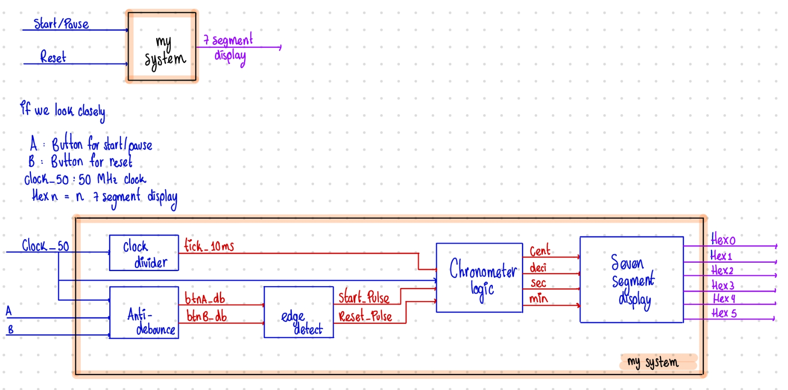

# DIAGRAMS

## RTL DIAGRAM

An RTL (Register Transfer Level) diagram is important because it visually shows how data moves between registers and how logic operations are performed in a digital circuit. It helps designers understand, verify, and optimize the behavior and structure of the hardware before implementation.

[RTL DIAGRAM](../Documentation/RTL_DIAGRAM.pdf)

## Black box diagram

A black box diagram is important because it provides a high-level representation of a system, focusing only on its inputs, outputs, and overall functionality rather than its internal details. This abstraction allows designers, developers, and engineers to understand what the system is supposed to do without being distracted by how it works internally.

*Black box diagram*.
