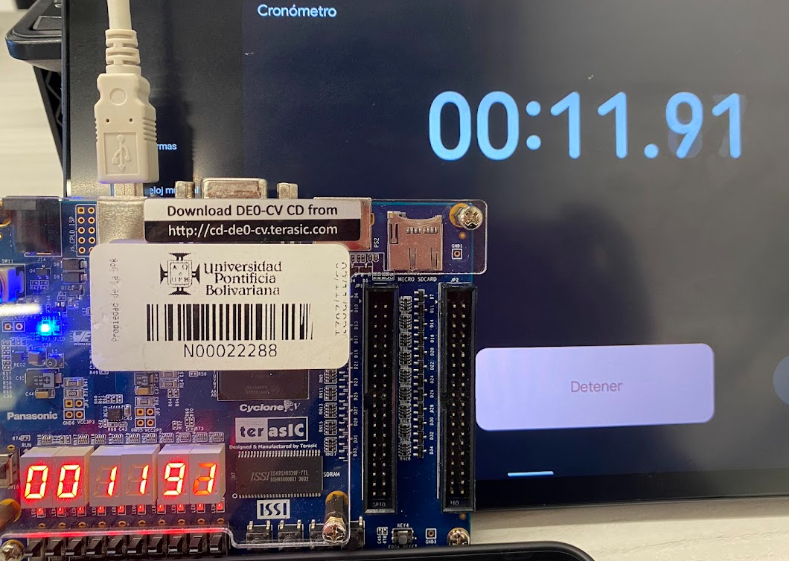
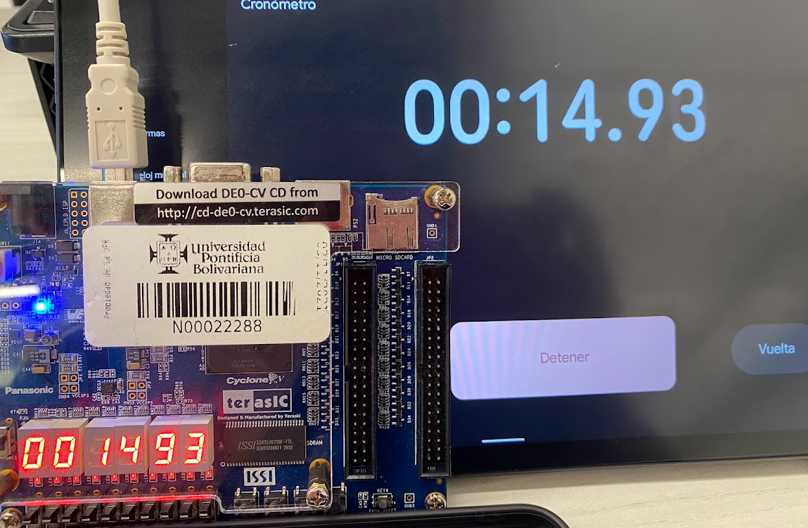
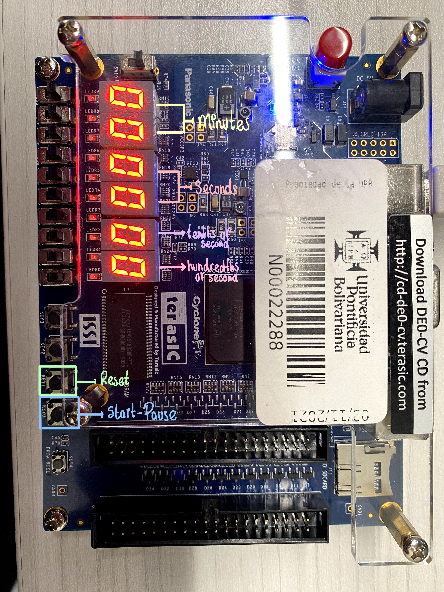

# CHRONOMETER ON VERILOG

The following project presents the development of a chronometer implemented on the DE0-CV FPGA, based on the Cyclone V chip (5CEBA4F23C7 model). The system features three main inputs:

1. A 50 MHz clock.
2. A start/pause button.
3. A reset button.

As outputs, the design uses the six built-in seven-segment displays on the board, arranged from right to left as follows:

* The first two display the hundredths and tenths of a second.
* The next two show the seconds.
* The last two represent the minutes.

this is the operation:

*Chronometer working*

*Chronometer working*

*inputs and outputs on the board*

Additionally, the project includes:

* [Source code](./Souce%20code/code.v): The complete source code of the chronometer, written in Verilog and synthesized in Quartus.

* [Pin Planner](./Source%20code/pin%20planner.md): the distribution of the pins used on the board

* [Description of the code](./Code%20description/Description.md): the explanation of the code by sections

* [Testbench](./Testbench/TB): A functional testbench developed in Icarus Verilog and [Waveform Captures](./Testbench/TB/TB_explanation.md).

* [RTL and Black Box Diagrams](./Diagrams/Diagrams.md) : representing the overall system structure and showing the internal hierarchy and connections of the design.

if you have never created a testbench before, you can also find tutorials on how to download and use the required programs

* [Programs for testbench](./Testbench/Install%20the%20program.md)
