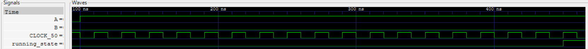
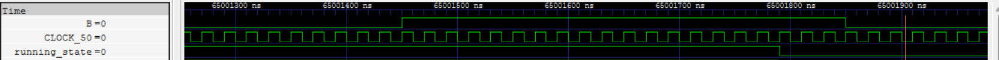
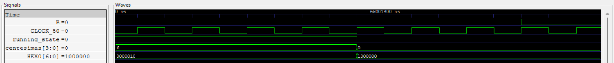
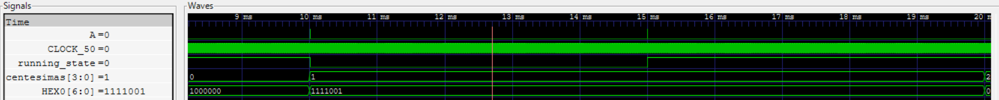
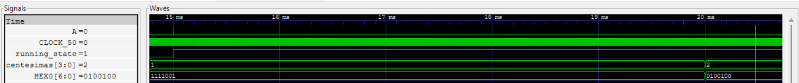
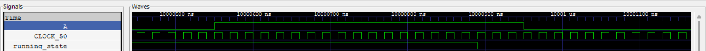
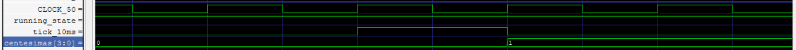
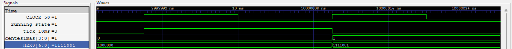
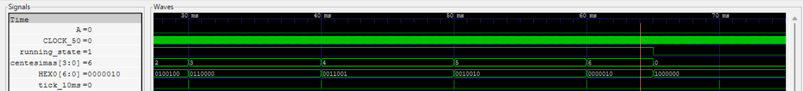

# EXPLANATION

It is known that the testbench is intended to automatically stimulate the inputs and ensure compliance with the design requirements. Therefore, the focus will be on verifying that the design performs according to the intended specifications.

The VCD file generated for the GTKWave simulation exceeds GitHub’s size limit; for that reason, it is not included in the repository. However, you can easily generate it yourself by following the tutorials, as they include the testbench instructions.

## Anti debounce

The design was intended so that, after 16 clock cycles of the main 50 MHz signal, the input from any button would be recognized as valid on the next clock edge. This behavior is illustrated below.

*Antidebounce for start*

*Antidebounce for restart*

## Buttons working

The reset must stop the entire program; that’s why it has the highest priority. The start/pause button should function as both — starting or stopping the counting process.

*Changes made for the reset*

*Changes made for pause*

*Changes made for unpause*

## Tick for 10ms

To allow the stopwatch to run, a tick signal was defined to trigger every 10 ms. It can be seen here.

*The Tick of 10 mS*

## Chronometer logic

In the following section, different operating scenarios of the stopwatch can be observed.

*Change of the running_state*

*Change in the hundredths*

*Changes in the first seven segment display*

*Chronometer working during 60 mS*